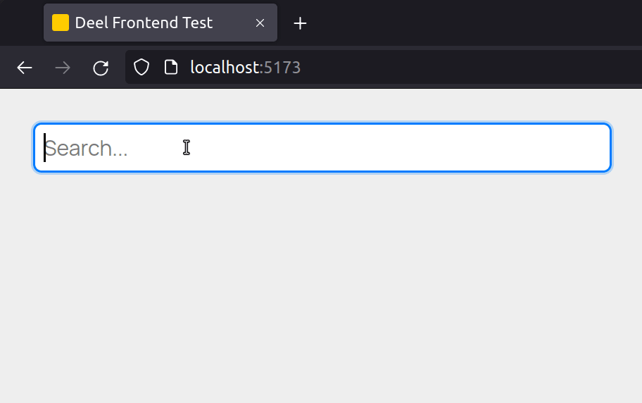

# Deel Frontend Test



## How to run

### Considerations

- Make sure that ports `5173` and `3000` are available.

### Using Docker Compose

1. Pull the Compose file [here](https://github.com/lualparedes/deel-devops-test)
1. Run  `docker-compose up` while being in the same directory where you pulled the Compose file

### Using Docker

1. Make sure you have [the backend](https://github.com/lualparedes/deel-backend-test) running
1. Build the image (you'll need to be in the root directory of this repository)
    ```
    docker build -t deel-front .
    ```
1. Run the image you just built
    ```
    docker run -it --rm -p 5173:5173 deel-front
    ```

### Using a local Node installation

1. Make sure you have Node 18
1. Make sure you have [the backend](https://github.com/lualparedes/deel-backend-test) running
1. Run the development server
    ```
    npm run dev
    ```
